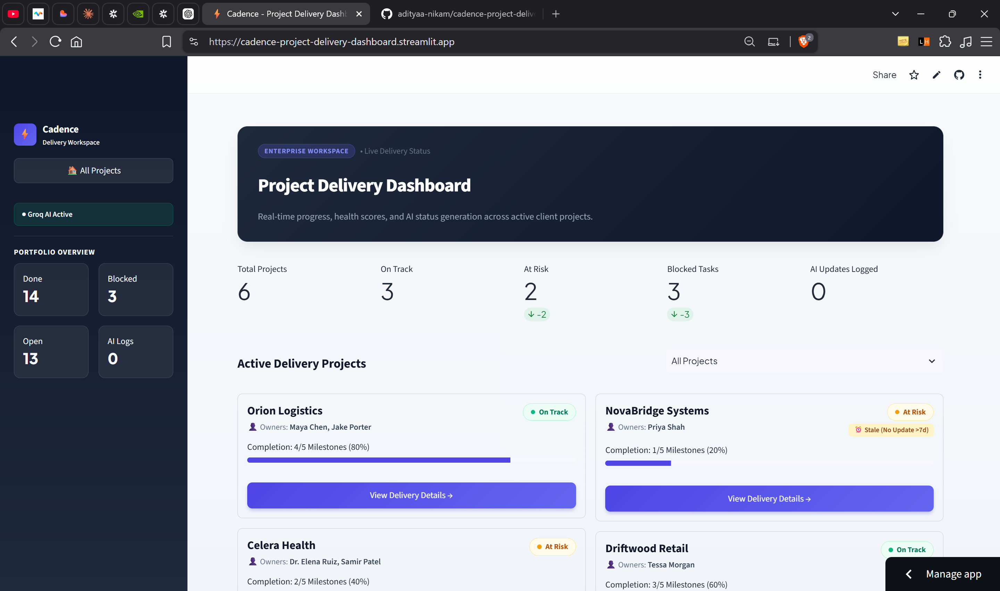

# 🚀 Cadence — AI-Powered Project Delivery Dashboard

> **Turn scattered project updates into structured delivery intelligence.**

Cadence is an AI-powered project delivery workspace designed to help delivery teams monitor project health, track milestones, identify risks, manage issues, and transform unstructured project updates into structured delivery information.

Built for the **FlytBase AI-Native Customer Teams Hackathon**.

---

## 🌐 Live Demo

🔗 **Live Application:** https://cadence-project-delivery-dashboard.streamlit.app

🔗 **GitHub Repository:** https://github.com/adityaa-nikam/cadence-project-delivery-dashboard

---

## 📸 Product Preview

### Portfolio Overview

The portfolio dashboard provides a unified view of active delivery projects, project health, milestone completion, blocked work, and AI-generated activity.



---

### Project Delivery View

Each project has a detailed delivery workspace with AI health assessment, milestone progress, risks, issues, and separate internal/customer perspectives.


---

# 🎯 The Problem

Once a customer signs on, delivery work begins across onboarding, implementation milestones, ongoing tasks, and issue resolution.

However, project updates are often scattered across:

- Emails
- Chat messages
- Calls and meeting notes
- Engineering updates
- Support tickets
- Manual status reports

This creates a major visibility problem.

Delivery teams have to manually interpret updates and maintain project status, while customers often lack a unified place to understand how their project is progressing.

### The traditional workflow

```text
Customer / Engineering / Support Updates
                  ↓
       Emails • Chat • Calls • Notes
                  ↓
        Manual Interpretation
                  ↓
        Manual Status Updates
                  ↓
       Fragmented Project View

---

# 💡 The Solution

Cadence provides a unified project delivery workspace that converts scattered project updates into structured delivery intelligence.

Instead of manually updating project status after every email, chat message, or engineering update, delivery teams can provide a natural-language update and let AI extract the important delivery signals.

### Cadence workflow

```text
Natural-Language Project Update
              ↓
          AI Processing
              ↓
    Extract Delivery Signals
              ↓
 ┌────────────┬────────────┬────────────┐
 ↓            ↓            ↓            ↓
Milestone   Progress       Risk       Blocker
              ↓
       Project State Update
              ↓
        Activity Feed
              ↓
    Customer Status Draft
